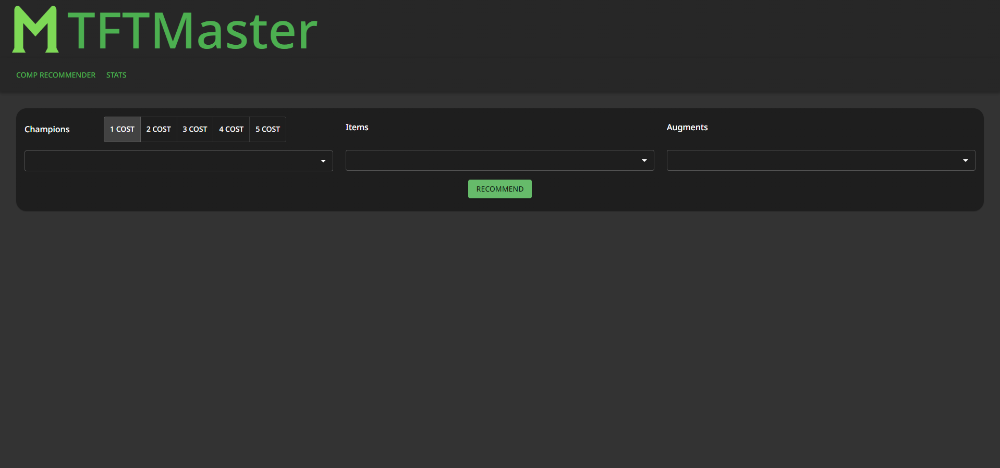
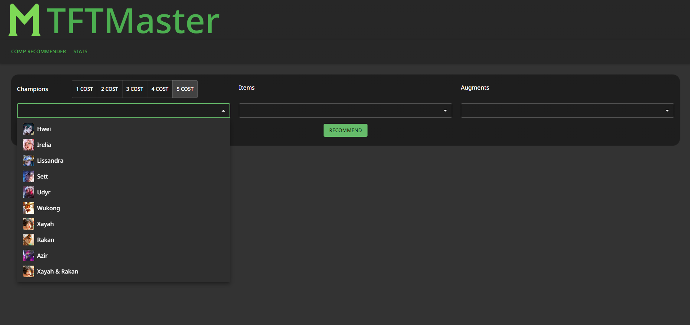
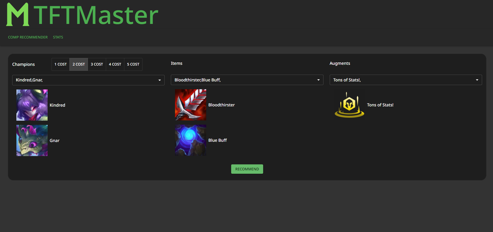
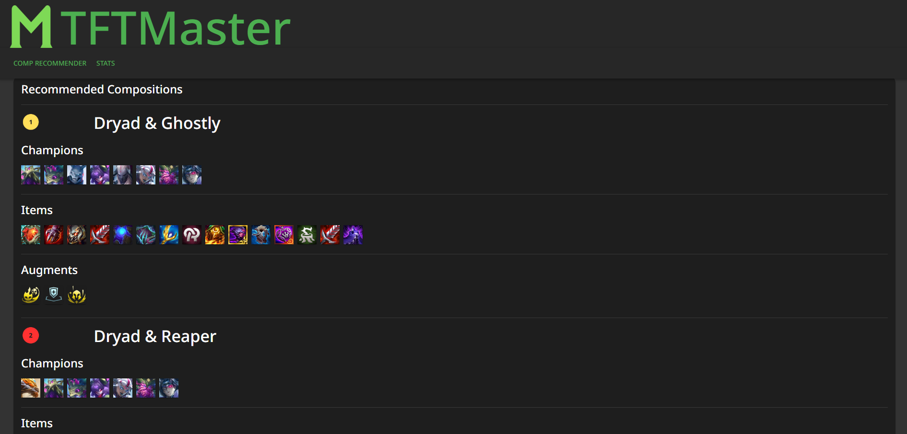
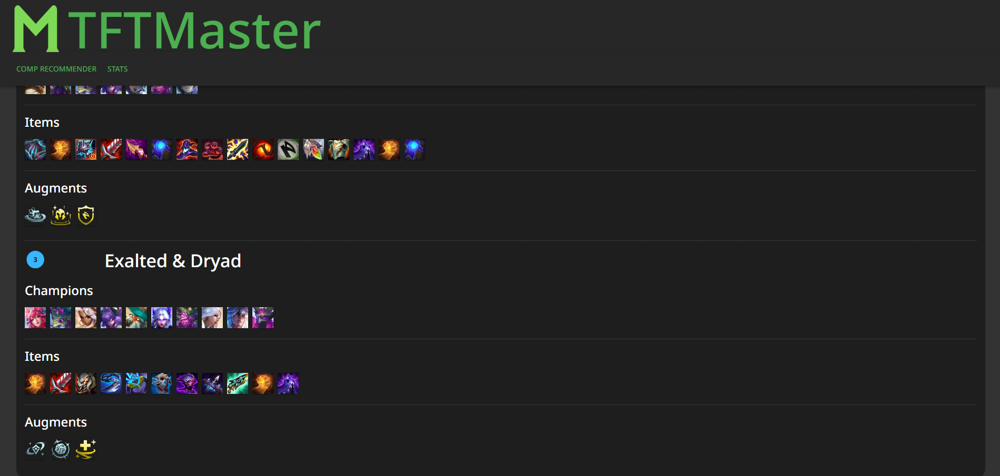

# TFTMaster: a Teamfight Tactics comp recommender tool

## Overview

TFTMaster allows you to select the champions, items, and augments you currently have and it recommends you 3 compositions to play, taken from actual Challenger and Grandmaster ranked players compositions. Accesses the Riot Games API in order to obtain the game data.

You start off by selecting your champions, items, and augments from the dropdown list:

After you click the "Recommend" button, the website will generate 3 composition recommendations for your current team, taken from the top TFT players' previous compositions.

## Technologies

This project is developed in React.js with Typescript and Material UI.

## Setup

Currently there is no backend server for this application, so in order to run it you will need to obtain a Riot Games API key from their [developer portal](https://developer.riotgames.com/). 
Then create a file named '.env' in the project directory and create an environment variable named REACT_APP_RIOT_API_KEY. Set this variable to your API key.
You may now use 'npm start' to use the application.

